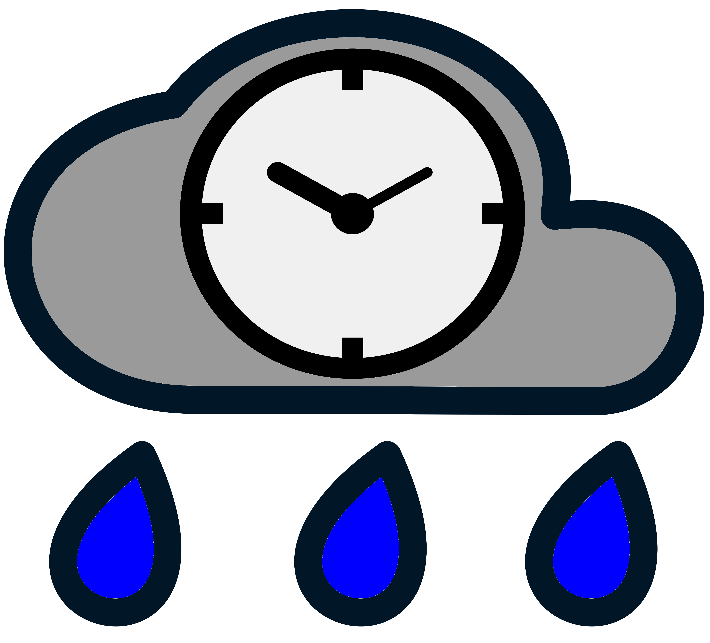

# Raintale

Raintale is a utility for publishing social media stories from groups of archived web pages (mementos). Raintale uses [MementoEmbed](https://github.com/oduwsdl/MementoEmbed)
 to extract memento information and then publishes a story to the given **storyteller**, a static file or an online social media service.

Raintale accepts the following inputs:
* a file containing a list of memento URLs (URI-Ms) (required)
* a title for your story (required)
* the URL of the underlying collection (optional)
* the author, organization, or algorithm that generated the story (optional)
* the storyteller to use when generating the story (e.g., HTML, Twitter, Markdown)
* an output file for saving the story (if applicable)
* a credential file for the a social media service (if applicable)
* a template file allowing the user to format their story differently than the defaults (optional, and not supported by all storytellers)

Raintale supports the following storytellers:
* facebook - (EXPERIMENTAL) publishes a story as a Facebook thread, with titles, snippets, URLs, and memento-datetimes supplied by MementoEmbed
* html - the HTML that makes up a story, suitable for pasting into a web page or a blogging application such as Blogger
* twitter - publishes a story as a Twitter thread, with titles, URLs, memento-datetimes, and images supplied by MementoEmbed
* template - given input data and a template file, this storyteller generates a story formatted based on the template and saves it to the given output file, allowing the end user to format their own stories
* jekyll-html - writes output to [Jekyll](https://jekyllrb.com/) HTML file format, suitable for use with Jekyll and GitHub pages
* jekyll-markdown - writes output to [Jekyll](https://jekyllrb.com/) Markdown file format, suitable for use with Jekyll and GitHub pages
* markdown - writes output to the [GitHub Flavored Markdown](https://github.github.com/gfm/) file format, suitable for pasting into GitHub
* mediawiki - writes output to this [MediaWiki](https://www.mediawiki.org/wiki/Help:Formatting) file format, suitable for pasting into MediaWiki pages
* video - (EXPERIMENTAL) creates an MP4 file containing the top images and sentences from the mementos in your story

Railtale also supports a number of presets for formatting a story for output to a specific file format:
* default - provides a default set of fields like those seen in the social cards from social networking; may also provide an approximation, depending on file format (html, markdown, mediawiki, and jekyll storytellers)
* thumbnails3col - provides a 3 column layout containing thumbnails of the submitted mementos (HTML storyteller only)
* thumbnails4col - provides a 4 column layout containing thumbnails of the submitted mementos (HTML storyteller only)

Note that not all file formats support all presets.

# Running Raintale

Raintale uses docker-compose to load and execute all dependencies. To run Raintale, do the following:
1. Create a directory on your system
2. Copy docker-compose.yml from this repository into that directory
3. Open a terminal
4. Type: ```docker-compose run raintale tellstory --help``` to find the list of options

For example to create a raw HTML story suitable for pasting, type the following within that prompt:

``
docker-compose run raintale tellstory -i story-mementos.txt --storyteller html -o mystory.html --title "This is My Story Title"	--generated-by "Me"
``

The output will be stored in ``mystory.html``.

To create a twitter story, you will need to create a Twitter app. Log into Twitter from a web browser and visit https://developer.twitter.com/en/apps for more information. Once you have created an app, make a file named ``twitter-credentials.yml``, save it in the same directory, and fill it with the following content.

```
consumer_key: XXXXXX
consumer_secret: XXXXXX
access_token_key: XXXXXX
access_token_secret: XXXXXX
```

Replace the ``XXXXXX`` values with the corresponding values as displayed on your Twitter app page.

Once that is done, type the following within the Docker prompt:

``
docker-compose run raintale tellstory -i story_mementos.txt --storyteller twitter --title "This is My Story Title"	--generated-by "Me” -c twitter-credentials.yml
``
# Installing Raintale without Docker

### Command Line Tool

Raintale uses ```pip``` for build and installation. Clone this repository and type the following from the root of the source code:

```pip install .``` 

to build and install the version from the source code on your machine.

### Graphical User Interface

To install the Raintale GUI, do the following:
1. Clone this repository
2. Change into the raintale-gui directory
3. Run the install-gui.sh script
This installation script will install [Wooey](https://github.com/wooey/Wooey) and other dependencies required to run the Raintale GUI.

Once the installation is complete, to start the Raintale GUI, do the following:
1. Run the ./start-gui.sh script
2. Once the service is started, you can access the Raintale GUI at http://127.0.0.1:8000/. 
It is important to make sure that the [MementoEmbed](https://github.com/oduwsdl/MementoEmbed) service is running as well.

To stop Raintale GUI, do the following:
1. Run the ./stop-gui.sh script
2. You may stop the [MementoEmbed](https://github.com/oduwsdl/MementoEmbed) service as well.

# The future of Raintale

We are working on additional storytellers and presets. Storytellers must be either a file format or an online service that supports an API. The choice in storyteller is highly dependent upon the capabilities and terms of that online service's API.
