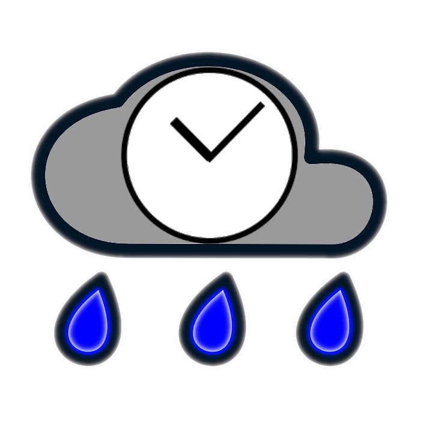

# Raintale

Raintale is a utility for creating social media stories from groups of archived web pages (mementos). Raintale uses MementoEmbed to extract memento information and then publishes a story to the given **storyteller**, a static file or an online social media service.

Raintale accepts the following inputs:
* a file containing a list of memento URLs (URI-Ms) (required)</li>
* a title for your story (required)</li>
* the URL of the underlying collection (optional)</li>
* the author, organization, or algorithm that generated the story (optional)</li>

Raintale creates stories using different formats. These formats influence the content available to a given storyteller. Raintale supports the following story formats:
* social card - content from cards for individual mementos, like those seen in social media and produced by MementoEmbed

Raintale supports the following storytellers:
* rawhtml - the HTML that makes up a story, suitable for pasting into a web page or a blogging application such as Blogger
* twitter - the resulting story with be a tweet and its replies, with titles, URLs, memento-datetimes, and images supplied by MementoEmbed

# Running raintale

Raintale uses docker-compose to load and execute all dependencies. To run raintale, do the following:
1. Create a directory on your system
2. Copy docker-compose.yml from this repository into that directory
3. Open a terminal
4. Type: ```docker-compose run raintale bash```
5. In that prompt, type ``raintale-cmd --help`` to find the list of options

For example to create a raw HTML story suitable for pasting, type the following within that prompt:

``
raintale_cmd -i story-mementos.txt --storyteller mystory.html --storyformat socialcard --title "This is My Story Title"	--mementoembed_api http://mementoembed:5550 --collection-url http://example.com/mycollection --generated-by "Me"
``


# Building raintale

Raintale uses ```pip``` for build and installation. From the root of the source code, just type:

```pip install .``` 

to build and install the version from the source code on your machine.

# The future of Raintale

We are working on additional storytellers and story formats. For example, in the near future we plan to add ``thumbnail`` as an story format. Storytellers must be either a file format or an online service that supports an API. The choice in storyteller is highly dependent upon the capabilities and terms of that online service's API.
