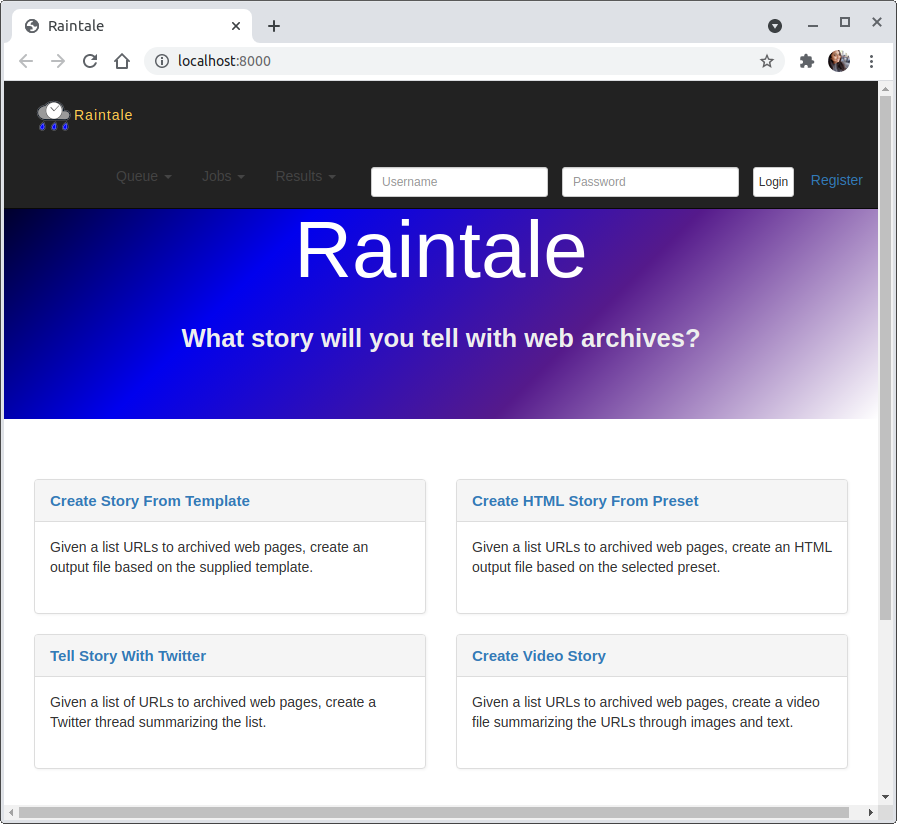
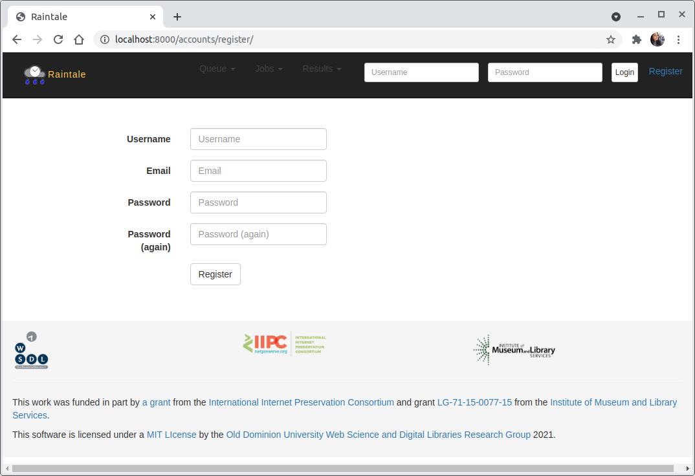
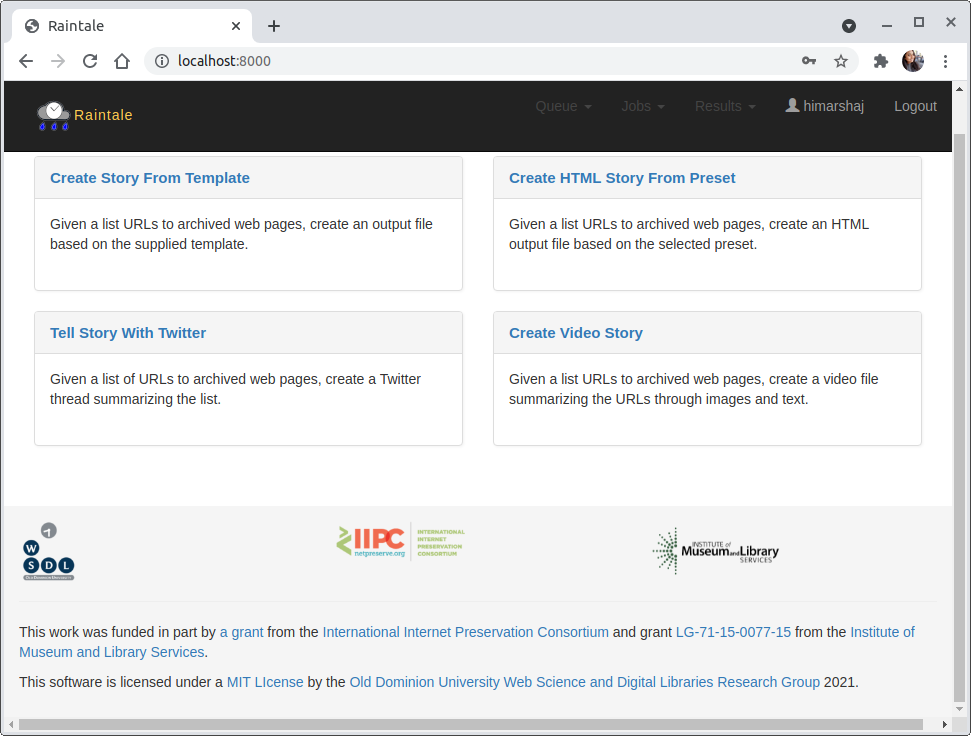
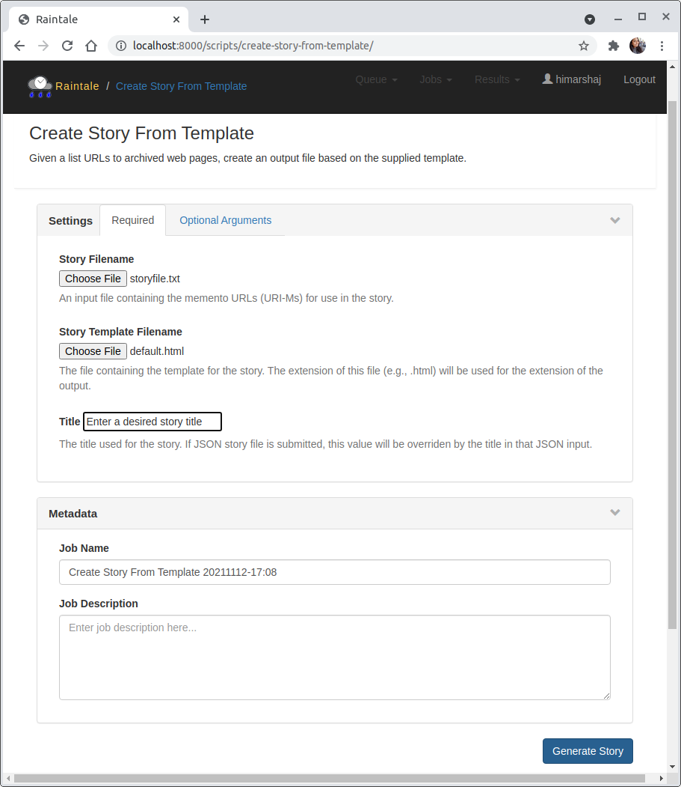
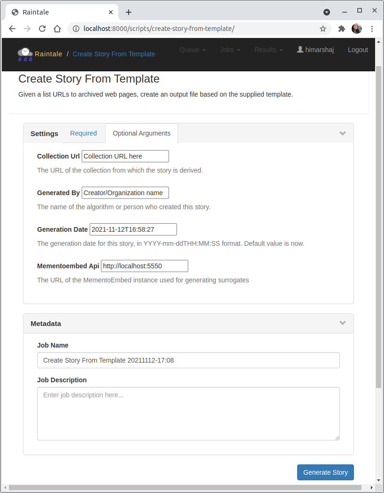
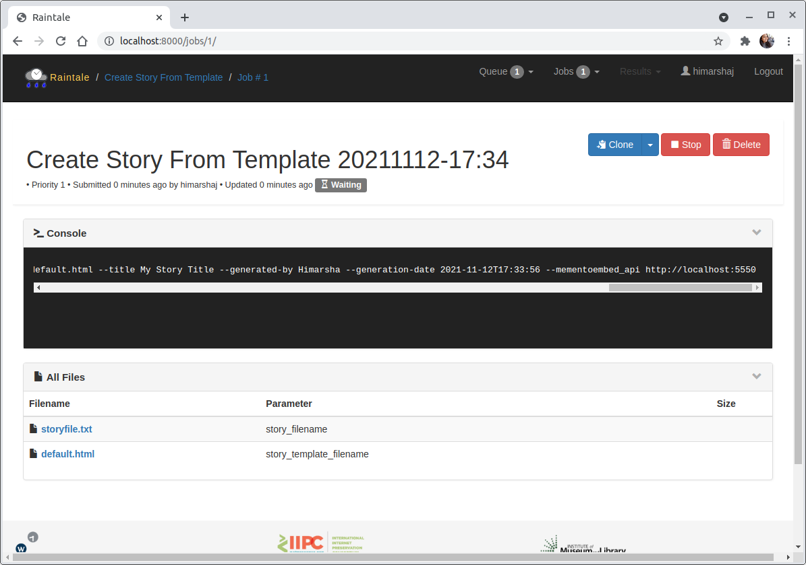
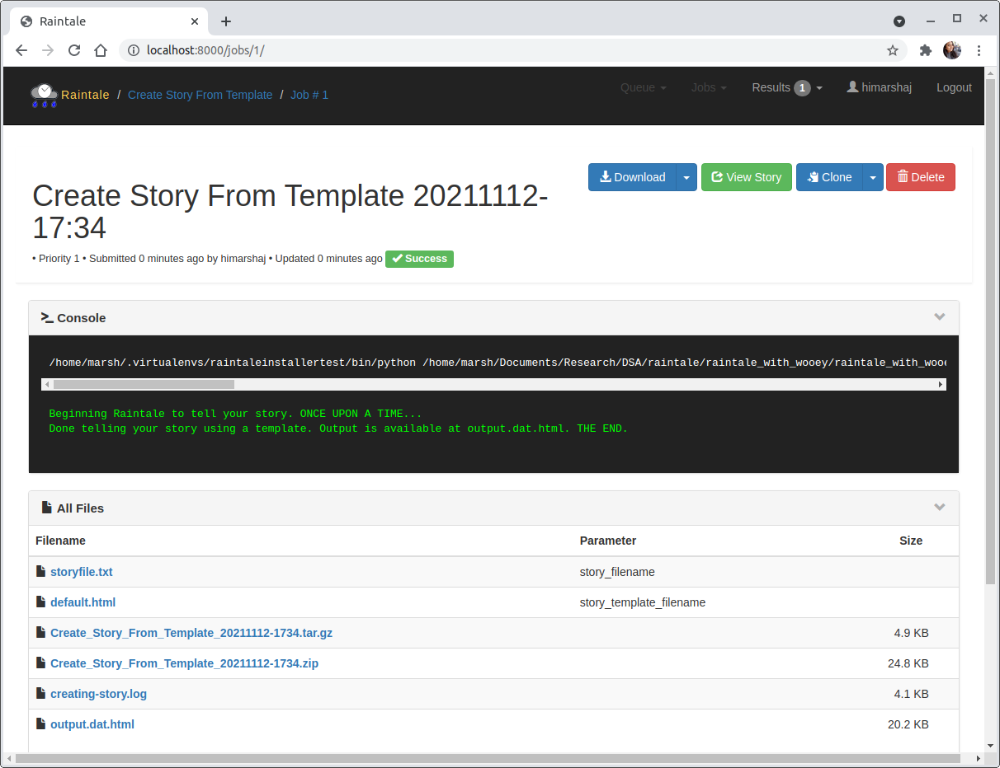
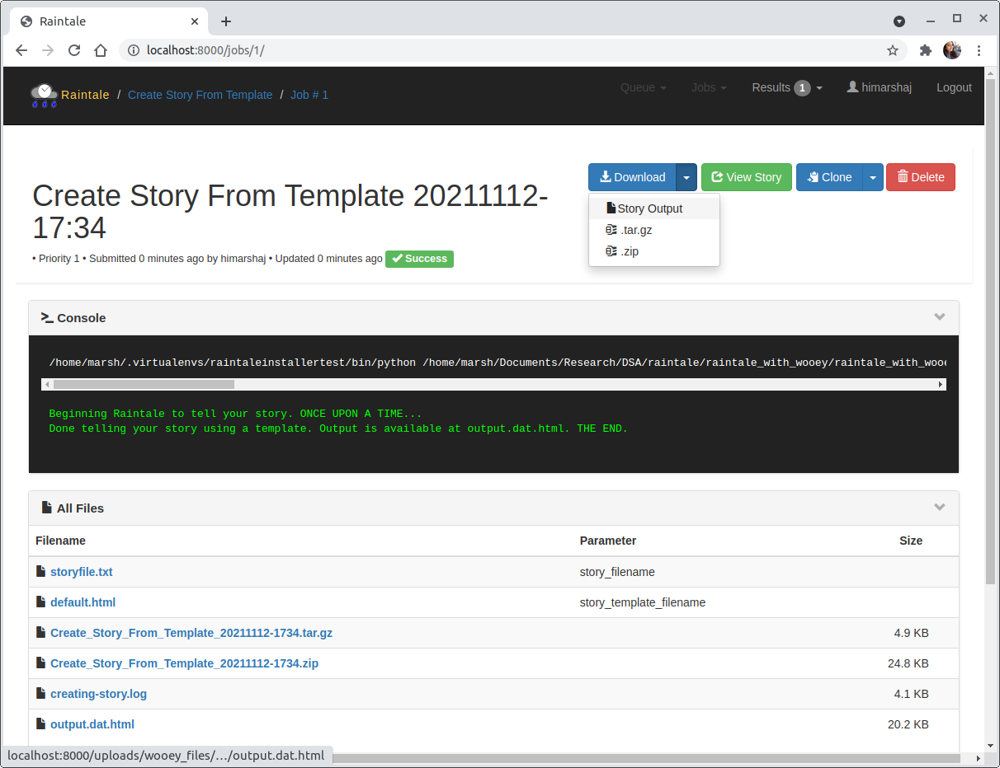
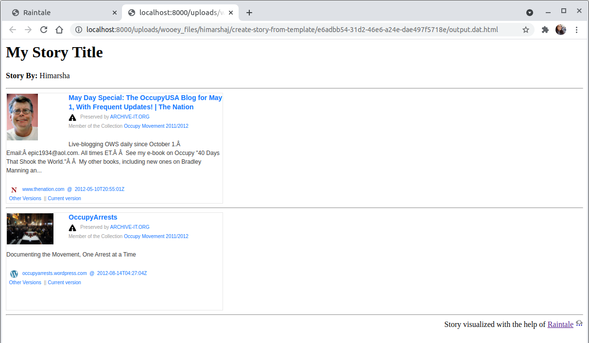

.. _getting_started_wui:

Getting Started With WUI
========================

Once the installation is complete (Refer:  :ref:`install_options`), you can access the Raintale WUI at http://localhost:8100/.

Create your Raintale User Account
---------------------------------

A user can register themselves as a new user by clicking on the “Register” button in the top right corner.

Different Types of Stories
--------------------------

Once registered and logged in, the Raintale user can create different types of stories using the below scripts.

* Create Story From Template
* Create HTML Story From Preset
* Tell Story With Twitter
* Create Video Story

(More informatioon on different types of stories can be found at :ref:`available_storytellers`)

Quick HTML Story using "Create Story From Template" Script
----------------------------------------------------------

A user should follow the below steps to generate a story from a template.

* Step 1: Upload a text file containing URLs (one URL per line) of archived web pages (e.g., mementos, captures, snapshots, URI-Ms) for use in the story. Here we have used a text file containing two URLs of archived web pages.
* Step 2: Upload any template file you would like to use. Here, we have used an HTML story template (If you would like to use the story template presets use "Create HTML Story From Preset" script to generate your story. You can also create your own template, refer to :ref:`creating_your_own_templates` for instructions). 
* Step 3: Specify a suitable title for the story.

Aditionally, Raintale user can also supply a few optional parameters for further customization.
	
* Collection URL: Specify the URL to the collection here.
* Generated By: Specify who generated the story here.
* Generation Date: Specify the story generation date here (default is set to current time).
* MementoEmbed API: Raintale needs MementoEmbed running. The user has the ability to specify the URL for the MementoEmbed instance (default is pointing to the port used in default configuration which is http://localhost:5550).

Once the above step is completed by submitting the required parameters to generate a story, the user will be able to view the jobs running and the submitted files.

Once the story is generated, the user is able to view a green “Success” button on the screen along with the CLI output with some additional information. You may need to refresh your screen so that the buttons display properly.

Download or View Story Output
----------------------------------------------------------

The user can download the story that they have generated into their local machine by clicking on the blue “Download” button.

If the user wants to simply view the story on a new tab by they can click on the green “View Story” button (For Twitter stories, the view story button will take you to the generated twitter story on https://twitter.com/). 

