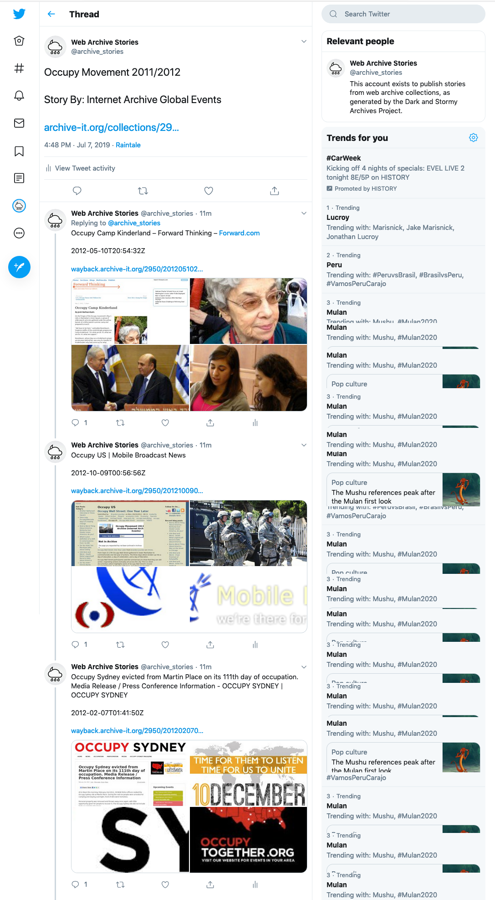

.. Raintale documentation master file, created by
   sphinx-quickstart on Mon Jul  1 16:40:12 2019.
   You can adapt this file completely to your liking, but it should at least
   contain the root `toctree` directive.

Raintale: Storytelling for Web Archives
====================================

What story do you want to tell with web archives?

Raintale is a utility for publishing social media stories from groups of archived web pages (mementos). Raintale uses `MementoEmbed <https://github.com/oduwsdl/MementoEmbed>`_ to extract memento information and then publishes a story with the given **storyteller**, to a static file or an online social media service. A Raintale user supplies a file containing a list of memento URLs, a story title, and a storyteller to use for publishing the story. 

Raintale is quite configurable, providing different publishing options as storytellers and file formats. Users may also provide different presets to configure how these storytellers format their stories. Finally, Raintale accepts a template file as an argument, allowing users to format their own stories.

For example, the HTML storyteller will use the default preset to render the story into an HTML file as seen below.

The Twitter storyteller will use the default preset to publish the story to Twitter as a tweets with a series of replies shown in the screenshot below.

.. note::

    Raintale only works for memento URLs (URI-Ms) from Memento-compliant web archives. It will not work for live web resources or mementos from web archives that do not support the Memento protocol. To create mementos of live web pages, use `the Save Page Now tool at the Internet Archive <https://archive.org/web/>`_, `the ArchiveNow Python utility <https://github.com/oduwsdl/archivenow>`_, or `the Mink Chrome Extension <https://chrome.google.com/webstore/detail/mink-integrate-live-archi/jemoalkmipibchioofomhkgimhofbbem?hl=en-US>`_.

.. toctree::
   :maxdepth: 2

   getting_started
   creating_story
   raintale_options
   templates
   license
