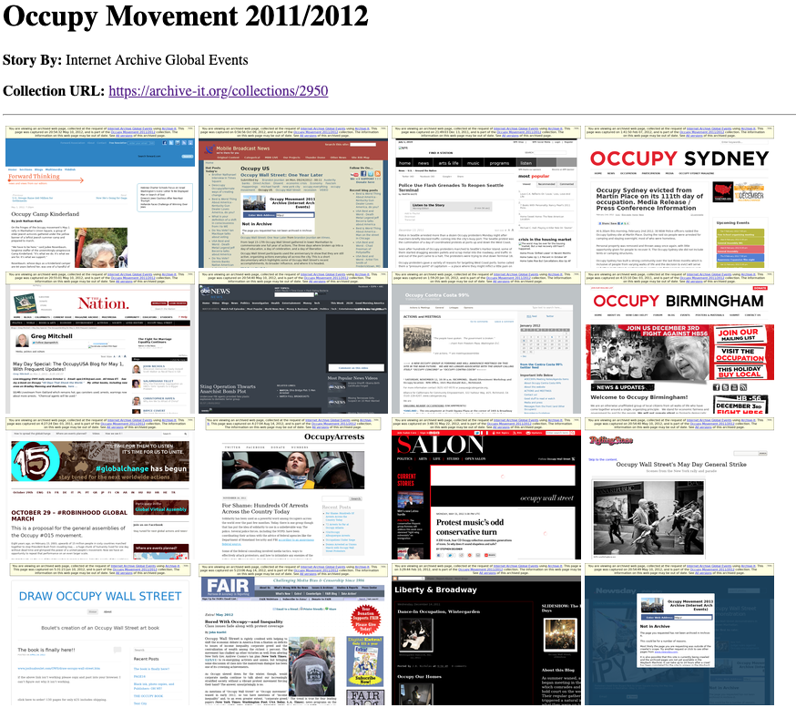

Creating Your Own Templates
===========================

Raintale allows the user to supply their own templates to format a story. Each template can be in a text-based format. Examples of text-based formats are HTML, XML, Markdown, and JSON. Raintale's presets are templates and you can view the files in the templates directory of the `Raintale GitHub <https://github.com/oduwsdl/raintale/tree/master/raintale/templates>`_ repository. Templates are built using an extension of the Jinja2 template engine. Because the format is an extension, not all Raintale templates are interoperable with Jinja2.

A Simple Template
-----------------

As noted in :ref:`building_story`, Raintale, at a minimum, accepts a list of memento URLs (URI-Ms) from which to build your story. An example template below creates a four-column row of thumbnails for each URI-M in the story.

.. code-block:: jinja
    :linenos:
    
    
<h1>{{ title }}</h1>

    
    
<strong>Story By:</strong> {{ generated_by }}

    

    
    
<strong>Collection URL:</strong> <a href="{{ collection_url }}">{{ collection_url }}</a>

    

    

    <table border="0">
    <tr>
    

    

        <td></td>

        
            </tr><tr>
        

    

    <!-- Element type {{ element.type }} is unsupported by the thubmnails3col template -->

    

    

In this example, the ``{{ title }}`` variable will be filled by the parameter of the ``--title`` argument of the ``tellstory`` command. The same for the ``{{ generated_by }}`` and ``{{ collection_url }}`` variables and their corresponding ``tellstory`` arguments.

The URI-M list supplied to the ``tellstory`` command is converted into a data structure that is stored in the ``elements`` variable. The template engine will iterate through this list using the Jinja2 code ```` on line 15 and the ```` on line 31 closing this loop.

If the URI-M list is supplied as a simple text file, then the ``element.type`` of each story element is set to ``link``. Other element types, such as ``text``, are covered in :ref:`building_story`. Your template is required to support at least element type, otherwise there will be no story. Only the ``link`` element type has any extensive configuration.

In this example, the ``{{ element.surrogate.thumbnail }}`` variable (line 19) contains the thumbnail corresponding to the URI-M discovered at that point in the loop. Let's break this variable down. The ``element`` portion is the iterator served by the Jinja2 loop by the line 15  statement ````. The ``surrogate`` portion of this variable indicates that we are looking for a feature of the memento behind the URI-M which in this case is a ``thumbnail``. 

If the user supplies 16 URI-Ms and information about the Archive-It collection *Occupy Movement 2011/2012*, then the template above will generate a story using thumbnails, as seen below.

There are many other features than ``thumnbail`` available for URI-Ms. Note that Raintale only provides features for URI-Ms from Memento-compliant web archives. It will not work for live web resources. In the following section, we cover more memento features that can be used in your stories.

A More Complex Example
----------------------

The following example displays how one can use Raintale templates with Markdown.

.. code-block:: jinja
    :linenos:

    **{{ title }}**

    
    **Story By:** {{ generated_by }}

    

    
    **Collection URL:** [{{ collection_url }}]({{ collection_url }})
    

    

    

    **{{ key|title }}**: {{ value }}

    

    

    

    ---

    

    

    **[{{ element.surrogate.title }}]({{ element.surrogate.urim }})**

    Preserved by  [{{ element.surrogate.archive_name }}]({{ element.surrogate.archive_uri }})

    
    Member of the Collection [{{ element.surrogate.archive_collection_name }}]({{ element.surrogate.archive_collection_uri }})
    

    {{ element.surrogate.snippet }}

     [{{ element.surrogate.original_domain }}  @  {{ element.surrogate.memento_datetime }}]({{ element.surrogate.urim }})

    [Other Versions](http://timetravel.mementoweb.org/list/{{ element.surrogate.memento_datetime_14num }}Z/{{ element.surrogate.original_uri }}) || [Current Version]({{ element.surrogate.original_uri }})

    

    {{ element.text }}

    

    

In this example, we highlight some additional functionality. If you supply a JSON story that contains a ``metadata`` key to a `JSON object <https://en.wikipedia.org/wiki/JSON#Data_types_and_syntax>`_, then the key value pairs for that object will be rendered within the loop from lines 13 to 17.

The loop for the story elements starts on line 21. For the ``link`` element type, the following features are available for a story:

* ``best_image_uri`` (line 27) - the best image found in the memento
* ``title`` (line 29) - the title of the memento
* ``urim`` (line 29) - the URI-M of this memento
* ``archive_favicon`` (line 31) - the favicon of the archive containing the Memento
* ``archive_name`` (line 31) - the name of the archive, typically its domain name in upper case
* ``archive_uri`` (line 31) - the URL of the web archive containing the memento
* ``collection_name`` (lines 33 and 34) - the collection name of the collection containing this memento; this only works for Archive-It collections
* ``collection_uri`` (line 34) - the URL of the collection containing this memento; this only works for Archive-It collections
* ``snippet`` (line 37) - the best text snippet extracted from the memento
* ``original_favicon`` (line 39) - the favicon of the original resource for which the memento is an observation
* ``original_domain`` (line 39) - the original domain of the memento
* ``memento_datetime`` (line 39) - the memento-datetime of the memento, when it was captured by the web archive
* ``memento_datetime_14num`` (line 41) - a specially formatted memento-datetime for use in some web archive URI-Ms
* ``original_uri`` (line 41) - the original URL for which the memento is an observation

